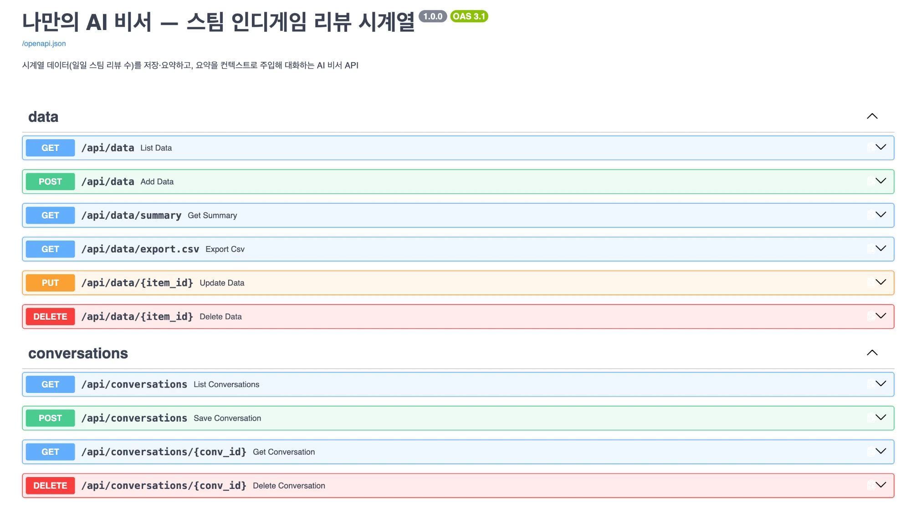
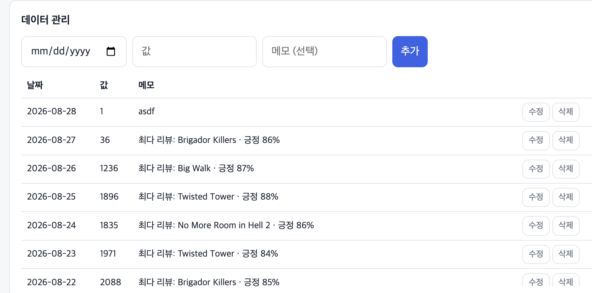
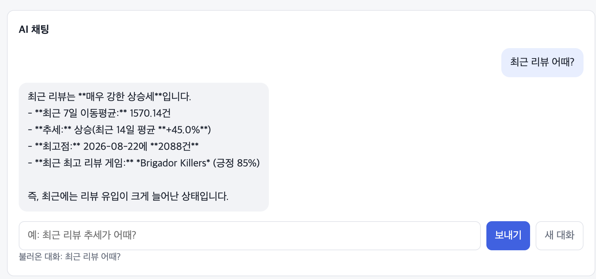
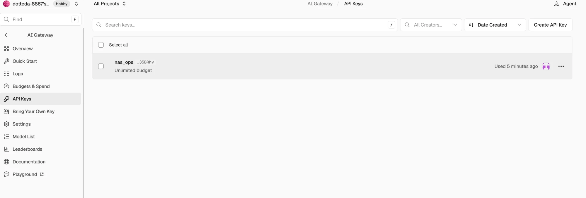

# 나만의 AI 비서 — 스팀 인디게임 리뷰 시계열

내 데이터를 아는 AI 비서. NAS 에서 매일 수집 중인 **스팀 인디게임 신규 리뷰 수(일 단위, 180일)**
시계열을 저장·요약하고, 그 요약을 시스템 프롬프트에 주입해 GPT 가 "내 상황을 아는" 답을 하게 한다.

## 무엇을 해결하나

일반 챗봇은 "요즘 인디게임 리뷰가 어때?"에 일반론만 답한다. 이 서비스는
`/api/data/summary` 가 만든 요약(기간·통계·이동평균·추세·요일 패턴)을 매 대화마다
시스템 프롬프트에 주입하므로, "최근 추세는? 최고점은 언제?" 에 **내 데이터의 수치로** 답한다.

## 기술 스택

- **백엔드**: FastAPI + Pydantic (라우터/서비스 분리, 요청 검증) · Swagger `/docs`
- **DB**: Firebase Firestore (`data`, `conversations` 컬렉션) — 키가 없으면 로컬 JSON 저장소로 자동 폴백
- **AI**: GPT API (OpenAI 호환 — Codyssey·Vercel AI Gateway 등 `OPENAI_BASE_URL` 로 게이트웨이
  교체 가능, Function Calling 1종 포함)
- **프론트엔드**: 바닐라 HTML/CSS/JS (채팅 + 로딩 표시 · CRUD · 대화 기록 불러오기 · 요약 카드 ·
  캔버스 차트(원계열+7일 이동평균) · CSV 내보내기 · 다크 모드)
- **컨테이너**: Dockerfile + docker-compose (NAS 데모 배포)

## 코드 구조 — 책임 분리

| 파일 | 책임 |
|---|---|
| `backend/main.py` | 앱 조립만: CORS·라우터 등록·정적 서빙·시드 적재. 비즈니스 로직 없음 |
| `backend/routers/*.py` | HTTP 계층: 요청을 받아 서비스를 부르고 상태코드를 결정. 계산·저장 로직 없음 |
| `backend/summary.py` | 분석 서비스: 시계열 요약 계산과 프롬프트 문자열 생성. HTTP 를 모름 |
| `backend/llm.py` | LLM 서비스: GPT 호출·도구 호출 루프. 저장소를 모름 (콜백으로 주입받음) |
| `backend/store.py` | 저장 계층: Firestore/로컬 JSON 을 같은 인터페이스로. 상위 계층은 어느 쪽인지 모름 |
| `backend/models.py` | 검증 계층: 모든 입력 검증은 Pydantic 스키마에서 끝낸다 |

라우터는 서비스를 부르고, 서비스는 서로를 모른다 — 예: `routers/chat.py` 가
`summary.compute_summary()` 와 `llm.chat()` 을 순서대로 부르는 조립자 역할만 한다.

## 데이터

- **출처**: 자체 수집기 indiepulse (Steam 공식 리뷰 API를 매일 폴링, SQLite 저장).
  추출 스크립트: [scripts/seed_from_indiepulse.py](scripts/seed_from_indiepulse.py)
- **정의**: 추적 중인 스팀 게임 전체의 일일 신규 리뷰 수. memo 에 그날 최다 리뷰 게임과 긍정 비율
- **규모**: 180 포인트 (2026-02-08 ~ 2026-08-27) → `data/seed.json`. 저장소가 비어 있으면 부팅 시 자동 적재
- **라이선스 주의**: Steam 리뷰 수는 공개 집계값만 사용하며 리뷰 본문은 포함하지 않는다
- **한계**: 수집기가 게임당 최근 50건까지만 리뷰를 당기므로 과거로 갈수록 표본이 얇다.
  최근 구간의 급증에는 이 수집 편향이 섞여 있어 "추세 상승" 판정은 최근 4주 비교로만 한다

## 시계열 분석 (요약 API 가 수행)

1. **기본 통계** — 합계·평균·최대·최소·표준편차, 최고점(날짜+메모)
2. **7일 이동평균** — 노이즈를 걷어낸 현재 수준
3. **구간 비교 변화율** — 최근 14일 vs 직전 14일 평균으로 상승/하락/유지 판정 (±10% 기준)
4. **요일별 집계** — 요일 패턴과 최다 요일

## API

| 메서드 | 경로 | 설명 |
|---|---|---|
| POST | `/api/data` | 데이터 추가 (date, value, memo) |
| GET | `/api/data` | 목록 조회 |
| PUT | `/api/data/{id}` | 수정 |
| DELETE | `/api/data/{id}` | 삭제 |
| GET | `/api/data/summary` | 요약 (프롬프트 주입용) |
| GET | `/api/data/export.csv` | CSV 내보내기 |
| POST | `/api/chat` | 요약 주입 → GPT 호출 → 대화 자동 저장 |
| POST | `/api/conversations` | 대화 저장 |
| GET | `/api/conversations` | 대화 목록 (messages 미포함, `message_count` 만) |
| GET | `/api/conversations/{id}` | 특정 대화 전체 messages 조회 (불러오기) |
| DELETE | `/api/conversations/{id}` | 대화 삭제 |
| GET | `/api/report` | 분석 리포트 원문(Markdown) — 프론트가 같은 페이지에서 렌더링 |
| GET | `/api/report.md` | 리포트 md 파일 다운로드 |
| GET | `/api/health` | 상태 (저장소 종류·LLM 설정 여부) |

### 요청/응답 예시

`GET /api/data/summary` — 챗 프롬프트에 주입되는 요약. 서드파티 대시보드(예: Grafana JSON
데이터소스)나 다른 클라이언트가 그대로 재사용할 수 있는 순수 JSON 이다:

```json
{
  "period": "2026-02-08 ~ 2026-08-27",
  "count": 180,
  "metrics": {"total": 45844.0, "average": 254.69, "max": 2088.0, "min": 1.0, "stdev": 546.42},
  "moving_average_7d": 1570.14,
  "trend": "상승 (최근 14일 평균 +45.0%)",
  "change_pct_14d": 45.0,
  "peak": {"date": "2026-08-22", "value": 2088, "memo": "최다 리뷰: Brigador Killers · 긍정 85%"},
  "weekday_average": {"월": 259.1, "화": 263.6, "수": 241.9, "목": 201.0, "금": 291.5, "토": 287.8, "일": 248.1},
  "best_weekday": "금",
  "weekday_seasonality_detrended": {"월": 22.2, "화": -79.6, "수": -105.1, "목": -32.9, "금": 87.5, "토": 117.5, "일": 56.1}
}
```

`POST /api/data` — 요청과 응답 (검증 실패 시 422 + 필드별 사유):

```json
// 요청
{"date": "2026-08-28", "value": 123, "memo": "테스트"}
// 응답 201
{"id": "7f85fc002c7a", "date": "2026-08-28", "value": 123.0, "memo": "테스트"}
```

`POST /api/chat` — 요청과 응답 (키 미설정 시 503 + 안내 문구):

```json
// 요청
{"message": "최근 리뷰 추세가 어때?", "conversation_id": null, "history": []}
// 응답 200
{"reply": "최근 리뷰 추세는 상승입니다. 최근 14일 평균이 +45.0% …", "conversation_id": "b0b9adf47585", "used_tools": []}
```

## 챗 동작 흐름 (컨텍스트 주입 + 도구 호출)

```
사용자 질문 → 요약 계산(compute_summary) → 시스템 프롬프트에 주입
  → GPT 호출 (tools: get_recent_data 제시)
  → (모델이 원본 수치가 필요하다고 판단하면) get_recent_data(days) 호출 → 재호출
  → 답변 반환 + conversations 에 자동 저장
```

도구 호출 근거는 응답의 `used_tools` 로 확인할 수 있고 프론트 하단에 표시된다.
(게이트웨이가 `tool_choice` 강제를 지원하지 않아 도구는 "제시"만 한다 — 호출 여부는 모델 판단.)

**컨텍스트 주입의 장단점** — 장점: 매 대화가 최신 데이터 요약을 반영하므로 모델이 "내 상황"의
실제 수치로 답하고, 원본 전체를 보내지 않아 토큰이 싸다. 단점: 요약에 없는 수치를 물으면
모델이 지어낼 위험이 있고(그래서 `get_recent_data` 도구로 원본 조회 경로를 열어 뒀다),
요약이 두 지표를 주면 모델이 그럴듯한 쪽에 앵커링한다 — 실제로 원시 요일 평균으로 리포트와
다른 답을 내는 것이 관측돼, 프롬프트에 결론(최저/최다 요일)까지 계산해 넣어 고쳤다.
**주입된 요약은 신뢰 경계 안의 데이터로 취급되므로, 사용자 입력이 요약에 섞이지 않게
요약은 서버가 계산한 값만으로 만든다.**

### 화면 시나리오 순서도 (데이터 관리 → 채팅 → 불러오기)

```
[데이터 관리] 추가/수정/삭제 ──▶ POST·PUT·DELETE /api/data
        │                              │
        ▼                              ▼
  목록·차트·요약 갱신 ◀────── GET /api/data, /api/data/summary
        │
[AI 채팅] 질문 입력 ──▶ POST /api/chat ─▶ 요약 주입 ─▶ GPT ─▶ 응답 표시
        │                                              └▶ conversations 자동 저장
        ▼
[대화 기록] 목록 클릭 ──▶ GET /api/conversations/{id} ─▶ 채팅창에 메시지 복원
                                                        (이어서 질문하면 같은 대화에 누적)
```

## 배포 URL

- **백엔드 API (Render)**: https://ai-data-assistant-3srn.onrender.com
- **Swagger**: https://ai-data-assistant-3srn.onrender.com/docs
- **프론트 (Vercel)**: https://ai-data-assistant-coral.vercel.app — 백엔드와 분리 배포된 정적 프론트.
  (백엔드 URL 에서도 같은 화면이 서빙되지만, 제출·공유용 프론트 주소는 이쪽)
- **저장소**: https://github.com/doji-kr/ai-data-assistant
- ⚠️ Render 무료 티어는 15분 무접속 시 슬립 — 첫 요청이 30초+ 걸릴 수 있다.
  프론트의 "생각 중…" 로딩 표시가 그 대기를 안내한다

## 대시보드 탐색 (분석 결과 서비스화)

메인 화면의 차트에서 **기간(전체/최근 90일/최근 30일)**과 **집계 단위(일/주)**를 바꿔가며
탐색할 수 있다. 시나리오 예:

1. `전체 × 일` — 7월 중순의 급증(관측 개시 효과)이 전체 스케일을 지배하는 것을 확인
2. `최근 30일 × 일` — 안정 구간만 확대: 8/22 최고점과 주말 상승·화수 하락 패턴이 보인다
3. `전체 × 주` — 주간 합계로 바꾸면 요일 노이즈가 사라지고 성장 감속(W32→W34)이 드러난다

집계 단위를 바꾸면 같은 데이터가 다르게 읽히는 것(일=요일 패턴, 주=추세)이 이 컨트롤의 목적이다.

## 로컬 실행

```bash
python3 -m venv .venv && .venv/bin/pip install -r requirements.txt
cp .env.example .env      # 키 채우기 (없으면 챗만 503, 나머지는 동작)
set -a; source .env; set +a
.venv/bin/uvicorn backend.main:app --reload
# → http://localhost:8000 (프론트) · http://localhost:8000/docs (Swagger)
```

## 컨테이너 (NAS 데모)

```bash
cp .env.example .env      # 최소 OPENAI_API_KEY
docker compose up -d --build
# → http://<NAS>:3030 · /docs
```

## 환경 변수 (최소 세트)

| 이름 | 설명 |
|---|---|
| `OPENAI_API_KEY` | GPT API 키 (없으면 챗 엔드포인트만 503) |
| `OPENAI_BASE_URL` | OpenAI 호환 게이트웨이 주소 (기본: Codyssey copa) |
| `OPENAI_MODEL` / `OPENAI_MAX_TOKENS` | 모델·토큰 상한 (비용 가드) |
| `FIREBASE_SERVICE_ACCOUNT_JSON` | 서비스 계정 JSON 경로 또는 문자열. 비우면 로컬 JSON 저장소 |
| `ALLOWED_ORIGINS` | CORS 허용 도메인 (콤마 구분, 기본 `*`) |

## 설계 노트

- **컬렉션 구조 선택 근거**: `conversations` 는 messages 배열을 문서 안에 **중첩**했다 —
  이 앱의 유일한 접근 패턴이 "대화 단위 통째 조회"이고, Firestore 는 조인이 없어 메시지를
  별도 컬렉션으로 정규화하면 대화 하나 열 때마다 N+1 조회가 되기 때문이다. 대가는 문서당
  1MB 상한인데, 대화당 메시지 40개 제한(models.py)이 그 안쪽에서 막아 준다. `data` 는
  포인트당 문서 1개 — CRUD 단위가 포인트 하나라서다.
- **대화 보존 정책**: 현재는 무기한 보존 + 수동 삭제(UI/DELETE API)다. 운영으로 간다면
  "90일 초과 & 미열람 대화 자동 삭제" 같은 기준을 Cloud Scheduler + created_at 쿼리로 거는
  것을 권장한다. 인덱스는 기본(단일 필드 created_at)으로 충분한 규모다.
- **비밀 취급**: 서비스 계정은 **Firestore 권한만 가진 최소 역할**로 발급하고(프로젝트
  Owner 키 금지), 저장은 환경변수/시크릿 매니저로만 — 이 저장소는 `.env`·`serviceAccount*.json`
  을 gitignore 로 차단한다. 키가 노출되면 재발급(로테이션)이 유일한 회수 수단이다.
- **`ALLOWED_ORIGINS` 설정 예시**:
  - 로컬 개발: `*` (편의 — 신용 정보가 없는 개발 데이터 전제)
  - 운영: `https://ai-data-assistant-coral.vercel.app` 처럼 **정확한 오리진만**. 여러 개는
    콤마로: `https://a.vercel.app,https://b.example.com`. 와일드카드 `*` 를 운영에 두면
    아무 사이트나 이 API 를 대신 호출할 수 있다 — credentials 를 켜는 순간 특히 위험하다.
- **입력 방어**: 길이 상한(질문 4,000자·메모 500자·메시지 8,000자)과 role 패턴 검증은
  Pydantic 에서 끝난다. 추가 권장: 제어문자 스트립, 프롬프트 주입 의심 문자열(예: "ignore
  previous instructions")의 로깅 — 챗 출력은 텍스트로만 렌더링하므로(innerText) XSS 경로는 없다.
- **콜드스타트 안내(프론트 문구 제안)**: 첫 응답이 늦을 때 로딩 표시("생각 중…") 옆에
  *"무료 서버가 잠들어 있었어요 — 첫 응답은 30초쯤 걸릴 수 있습니다"* 를 띄우는 것을 권장.
- **요약 기준 바꾸기**: [backend/summary.py](backend/summary.py) 상단 상수 4개만 고치면 된다 —
  `MA_WINDOW`(이동평균 창, 기본 7) · `TREND_WINDOW`(추세 비교 창, 기본 14) ·
  `TREND_THRESHOLD_PCT`(상승/하락 문턱, 기본 10) · `SEASONALITY_WINDOW`(계절성 창, 기본 56).
  예: "최근 30일 기준 추세"로 바꾸려면 `TREND_WINDOW = 30`.

## 배포 (Render / Vercel)

- **Render(백엔드)**: 이 저장소를 GitHub 에 푸시 → Web Service 생성 →
  Build `pip install -r backend/requirements.txt` · Start `uvicorn backend.main:app --host 0.0.0.0 --port $PORT`
  → 환경 변수 위 표대로 설정 (`ALLOWED_ORIGINS` 에 Vercel 도메인).
  무료 티어는 슬립 후 첫 요청이 30초+ 걸릴 수 있다 — 프론트 로딩 표시("생각 중…")가 그 대기를 안내한다.
- **Vercel(프론트)**: `frontend/` 를 정적 배포하고 `index.html` 의 `window.API_BASE_URL` 에
  Render 백엔드 URL 을 넣는다 (또는 빌드 환경변수로 치환).

## 제출 스크린샷

**① Swagger UI** — 배포 백엔드의 `/docs`. data(CRUD·요약·CSV)와 conversations(저장·조회·삭제)
라우터가 태그로 분리되어 있다.



**② 데이터 관리(CRUD)** — 한 건 추가 직후 목록이 갱신된 화면. 각 행에 수정·삭제 버튼.



**③ AI 채팅 + 대화 불러오기** — "최근 리뷰 어때?"에 요약이 주입된 답(7일 이동평균·추세·최고점·
최다 리뷰 게임)을 **내 데이터의 수치로** 반환. 하단 "불러온 대화" 표시는 대화 기록에서 이전
대화를 복원해 이어가는 상태다.



**④ AI 게이트웨이 키 콘솔** — OpenAI 호환 게이트웨이(Vercel AI Gateway)의 API 키와
사용 이력(Used 5 minutes ago). 챗 기능이 실제 키로 호출되고 있음을 보여준다.



## 과제 목표 답변 — 스스로 설명할 수 있어야 하는 것들

### 1. 데이터 분석 사고

- **질문 정의(3개+)**: 이 데이터로 답하려 한 질문은 [REPORT.md](REPORT.md) 2절의 4개다 —
  ① 180일 전체에 추세가 있는가, 있다면 실제 신호인가 ② 급증 구간은 무엇(게임 이벤트 vs
  수집기 변화)과 연결되는가 ③ 요일 패턴이 있는가 ④ 주간 성장률은 안정적인가.
  "그래프로 확인 가능한 것"(①③)과 "추가 해석이 필요한 것"(②④)을 섞었다.
- **결측치/이상치 처리 기준**: 결측치는 *있어야 할 자리가 빈 값*, 이상치는 *분포에서 크게
  벗어난 값*이다. 이 데이터는 리뷰 0건인 날에 행 자체가 없어 "결측=0건"과 구분되지 않으므로
  **보간하지 않고** 값이 있는 180일만 썼다(0으로 채우면 관측 개시 효과를 과장한다).
  이상치인 8/22(2,088건, 평균+3σ 초과)는 **제거하지 않았다** — 화제성 감지가 목적인 데이터에서
  급등일은 잡음이 아니라 신호이기 때문이다. 대신 부분 관측인 마지막 날만 분해·예측 입력에서 뺐다.
- **관찰 vs 해석**: 관찰은 그래프에서 읽은 수치("전반 90일 평균 3.2건 → 후반 506.1건"),
  해석은 그 원인에 대한 가설("수집기가 7/19 가동됐고 게임당 최근 50건만 당기기 때문")이다.
  REPORT의 인사이트는 전부 관찰(Fact)/원인(Why)/행동(Action)으로 분리해 썼고, 해석은
  반례 검토("하루 만에 수백 배 뛰는 시장 이벤트는 반례가 없어 기각")를 붙여 가설임을 명시했다.

### 2. 시계열 데이터 이해

- **트렌드/계절성/노이즈**: 트렌드는 장기 방향(여기선 7월 말~8월 중순 상승 후 감속),
  계절성은 주기적 반복(요일 효과 — 토 +152.7 vs 화 −146.7), 노이즈는 둘로 설명 안 되는
  잔차(8/22 급등일의 잔차가 최대 — 개별 게임 이벤트)다. REPORT 4-4에서 가법 모형
  (원계열 = 트렌드 + 계절성 + 잔차)으로 실제 분리했다.
- **왜/어떻게 적용했나**: **7일 이동평균**은 요일 노이즈를 상쇄하려고(7의 배수 창이 주말
  효과를 한 주기로 덮는다) 원계열 위에 겹쳐 그렸다. **변화율(구간 비교)**은 전 기간 회귀가
  관측 개시 효과로 왜곡되기 때문에, 수집이 안정된 최근 14일 vs 직전 14일 평균 비교(±10%
  기준)로만 추세를 판정했다. 이 둘에 요일별 집계·분해·베이스라인 예측(백테스트 MAE 185건
  vs naive 338건)을 더해 총 5가지 기법을 썼다.

### 3. AI 활용 역량

- **질문을 던지고 검증하기**: AI(Claude Code)에게 "이 시계열에서 추세를 어떻게 판정할까"류의
  분석 질문을 던지고, 생성된 코드와 수치는 **원본 SQLite에 독립 쿼리를 날려 대조**했다
  (합계 45,844건·최고점 8/22 일치 확인). 서비스의 GPT 챗도 같은 원리로 검증했다 — 모델이
  원시 요일 평균에 앵커링해 리포트와 다른 답("목요일 최저")을 내는 것을 발견하고, 요약
  프롬프트에 트렌드 제거 계절성과 결론(최저/최다 요일)을 명시해 고쳤다.
- **최종 판단은 사람이 근거를 들고**: "그래프의 급증은 시장 신호가 아니라 관측 개시 효과"라는
  이 분석의 핵심 결론은 수집기 가동일(2026-07-19)을 DB의 `fetched_at` 최솟값으로 직접 확인해
  사람이 확정했다. 추세 판정 기준(±10%), 이상치 유지 결정, 수집 편향을 한계로 명시한 것도
  모두 근거를 딸린 사람의 판단이다.

## AI 사용 로그 (과제 의무 항목)

1. **사용 작업**: 백엔드/프론트 코드 작성, 시계열 요약 로직 설계, 문서 작성 전반을
   Claude Code (Fable 5) 로 수행. 런타임 챗 기능은 GPT API 사용
2. **사용 이유**: 반복 코드(CRUD·프론트) 시간 절감 + 시계열 기법 선택지 탐색
3. **검증 방법**: 전 엔드포인트 curl 실측(정상·검증 실패·404·503 경로), 요약 수치는
   원본 SQLite 를 별도 쿼리로 대조, 프론트는 브라우저 실행으로 확인. 최종 판단
   (추세 판정 기준 ±10%, 수집 편향 한계 명시)은 사람이 근거를 들어 확정
