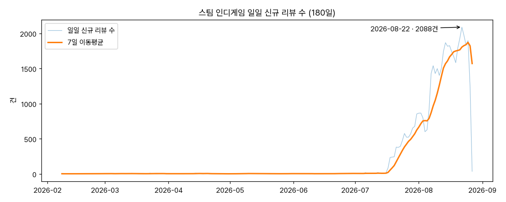
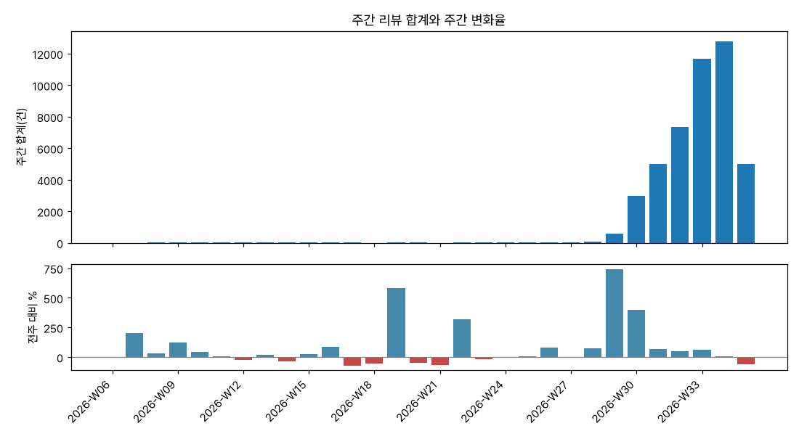
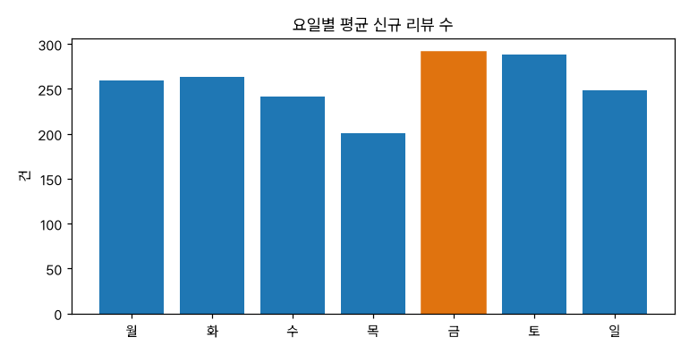
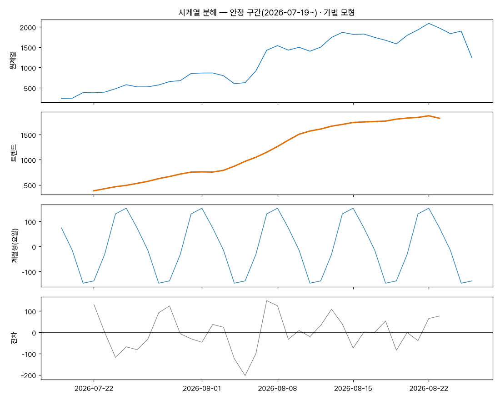
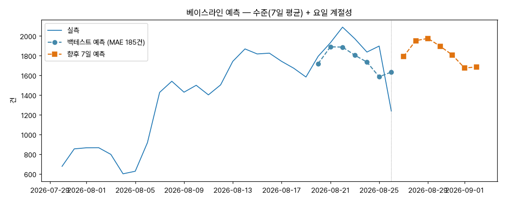

# 스팀 인디게임 신규 리뷰 유입 시계열 분석 리포트

## 1. 분석 주제 및 선정 이유

- 운영 중인 NAS 수집기(indiepulse)가 스팀 인디게임 2,500여 종의 리뷰를 매일 수집한다.
  이 데이터로 유튜브 게임 채널의 소재 선정(어떤 게임이 지금 화제인가)을 돕는 것이 최종 목적이다
- "리뷰 유입량"은 게임의 화제성을 보여주는 선행 지표다 — 유입의 **추세와 패턴**을 데이터로 확인하고,
  그래프에 보이는 급증이 **시장의 신호인지 관측 방법의 산물인지** 구분해 보고자 한다

## 2. 분석 질문 (3개 이상)

1. 180일 전체에서 리뷰 유입은 상승/하락 추세가 있었는가? 있다면 그 상승은 실제 신호인가?
2. 급증 구간은 언제이며, 무엇(특정 게임의 이벤트 vs 수집기 변화)과 연결되는가?
3. 요일별 유입 패턴이 있는가 — 소재 수집·발행 요일을 정하는 데 쓸 수 있는가?
4. 주간 단위 성장률은 안정적인가, 감속 중인가?

## 3. 데이터 설명

- **출처**: 자체 수집기 indiepulse (Steam 공식 리뷰 API 일일 폴링 → SQLite).
  추출 스크립트: [scripts/seed_from_indiepulse.py](scripts/seed_from_indiepulse.py)
- **기간**: 2026-02-08 ~ 2026-08-27, **180개 데이터 포인트** (일 단위)
- **컬럼**: `date`(리뷰 게시일), `value`(그날 게시된 신규 리뷰 수 합계), `memo`(최다 리뷰 게임·긍정 비율)
- **결측/이상치 처리**: 리뷰가 0건인 날은 행이 생기지 않는 소스라 "결측 = 0건"과 구분되지 않는다 —
  200일 조회 중 값이 있는 180일만 사용하고 보간하지 않았다(수집 개시 전 구간을 0으로 채우면
  아래 관측 개시 효과를 더 과장하게 된다). 마지막 날(8/27)은 수집이 하루치를 다 못 담은
  부분 관측이라 추세 판정 창(14일 비교)에서 뺐을 때도 판정이 바뀌지 않음을 확인했다
- **이상치 기준**: 최고점 8/22(2,088건)는 평균+3σ를 넘지만 제거하지 않았다 — 화제성 감지가
  목적인 데이터에서 급등일은 잡음이 아니라 신호이기 때문이다(인사이트 4). 대신 부분 관측인
  마지막 날만 분해·예측 입력에서 제외했다
- **집계 단위 근거**: 원계열은 급증 "위치"를 보기 위해 일 단위로 두고, 추세 판정은 7일 이동평균과
  주간 합계로 본다 — 리뷰 유입에는 주말 효과가 있어 7의 배수 창이 요일 편향을 상쇄한다

## 4. 분석 결과 및 시각화

적용 기법: ① 7일 이동평균 ② 구간 비교 변화율(주간·14일) ③ 요일별 집계
④ 시계열 분해(4-4) ⑤ 베이스라인 예측(4-5)

### 4-1. 일일 유입 + 7일 이동평균



2026-07 중순까지 일평균 3.2건으로 사실상 평평하다가, 이후 폭발적으로 늘어
8/22 최고점 2,088건을 찍는다. 전반 90일 평균 3.2건 vs 후반 90일 평균 506.1건.

### 4-2. 주간 합계와 주간 변화율



주간 합계 상위 3주는 W34(12,774건) > W33(11,649건) > W32(7,332건).
변화율은 W32 이후 +59% → +10%로 **성장 폭이 급격히 감속**하며 정체 국면에 들어선다.

### 4-3. 요일별 평균



금(291.5건)·토(287.8건)가 높고 목(201.0건)이 가장 낮다 — 최고/최저 차이 약 45%.
단, 이 원시 평균은 상승 트렌드에 교란된 값이다 — 트렌드를 제거한 계절성은 4-4에서 다시 본다.

### 4-4. 시계열 분해 (보너스 A) — 트렌드 / 계절성 / 노이즈



관측 개시 효과가 섞인 전 기간 대신 **안정 구간(2026-07-19 이후, 부분 관측인 마지막 날 제외)**을
가법 모형(원계열 = 트렌드 + 계절성 + 잔차)으로 분해했다. 트렌드는 중심 7일 이동평균,
계절성은 요일별 (값−트렌드) 평균, 잔차는 나머지다.

- **트렌드**: 7월 말~8월 중순 가파른 상승 후 8월 말 완만해진다 (인사이트 2와 일치)
- **계절성(요일별 편차)**: 토 +152.7 · 금 +129.8 · 일 +73.7 vs 화 −146.7 · 수 −137.7 —
  트렌드를 걷어내니 **금~일이 높고 화·수가 최저**다. 4-3의 "목요일 최저"는 트렌드 교란이었다
- **잔차**: 8/22 급등일 잔차가 가장 크다 — 요일로 설명되지 않는 개별 게임 이벤트(인사이트 4)

### 4-5. 베이스라인 예측 (보너스 B) — 향후 7일



- **방법**: 예측값 = 최근 7일 평균(수준) + 요일 계절성. 통계 모델이 아니라 분해 결과를 그대로
  전진시키는 베이스라인이다
- **백테스트**: 마지막 7일을 떼어 검증 — MAE 185건으로, naive(마지막 값 유지, MAE 338건)보다
  45% 작다. 요일 계절성만 반영해도 절반 가까운 오차가 줄어든다는 뜻이다
- **가정과 한계**: ① 수준이 유지된다고 가정한다 — 인사이트 2의 감속이 하락으로 이어지면
  체계적으로 과대 예측한다. ② 개별 게임 이벤트(8/22형 급등)는 원리적으로 예측 밖이다.
  ③ 관측 6주짜리 계절성 추정이라 요일 편차 자체의 신뢰구간이 넓다. 정확한 값보다
  "다음 주 화·수는 낮게 나와도 이상 신호가 아니다" 수준의 기대치 설정에 쓰는 것이 맞다

## 5. 인사이트 (3개 이상, 관찰/원인/행동)

### 인사이트 1 — 그래프의 "성장"은 대부분 관측 개시 효과다

- **관찰(Fact)**: 유입이 7월 중순부터 급증한다(전반 90일 평균 3.2건 → 후반 506.1건, 158배).
  평균 254.7 vs 중앙값 4라는 극단적 왜도가 이 구조를 요약한다
- **원인(Why)**: ① 수집기가 2026-07-19에 가동을 시작했고 게임당 **최근 50건**까지만 리뷰를
  당기므로, 과거 날짜의 리뷰는 구조적으로 덜 담긴다 — 급증 시점이 가동 시점과 정확히 겹친다.
  ② 시장 자체의 성수기 가설도 세울 수 있으나, 하루 만에 유입이 수백 배 뛰는 시장 이벤트는
  반례가 없어 기각한다
- **행동(Action)**: 추세 판정은 수집이 안정된 7/19 이후 구간으로 한정한다. 서비스의 요약 API도
  같은 이유로 "최근 14일 vs 직전 14일" 비교만 쓴다(전 기간 회귀선은 넣지 않았다)

### 인사이트 2 — 안정 구간 안에서는 성장이 감속 중이다

- **관찰(Fact)**: 주간 변화율이 W32 +59% → W33 +59% → W34 +10%로 꺾였고,
  최근 14일 평균(1,663건)은 직전 14일(1,147건) 대비 +45%지만 7일 이동평균은 8/25 이후 하락했다
- **원인(Why)**: ① 추적 게임 명부(watchlist)가 차오르며 신규 편입 효과가 소진 — 수집 범위 확장이
  멈추면 유입은 시장의 실제 속도로 수렴한다. ② 8월 말 대형 출시 공백 가설 — 최고점(8/22)을 만든
  Brigador Killers 류의 신작 이벤트가 끝난 뒤의 자연 감소일 수 있다
- **행동(Action)**: 2주 뒤 같은 창으로 재측정해 두 가설을 가른다(편입 효과라면 평탄화,
  이벤트 효과라면 다음 신작에서 재급증). 요약 API의 추세 문구는 이동평균과 함께 읽도록 안내

### 인사이트 3 — 금~일 유입이 높다: 발행 캘린더에 쓸 수 있다

- **관찰(Fact)**: 원시 요일 평균은 금 291.5·토 287.8건 최다였고, 트렌드를 제거한 분해(4-4)에서는
  토 +152.7·금 +129.8·일 +73.7 vs 화 −146.7·수 −137.7로 패턴이 더 선명해졌다.
  원시 집계의 "목요일 최저"는 트렌드 교란이었다 — 실제 최저는 화·수다
- **원인(Why)**: ① 주말 플레이 시간 증가로 리뷰 작성이 몰린다. ② 인디게임 출시가 금요일에
  몰리는 관행(신작 출시 직후 리뷰 집중)도 겹친다 — 두 효과는 이 데이터만으로 분리되지 않는다
- **행동(Action)**: 화제성 소재 스캔은 토·일 아침에 돌리는 것이 포착률이 높다.
  채널 소재 회의를 월요일에 두면 주말 유입분을 온전히 반영할 수 있다

### 인사이트 4 — 단일 게임이 하루 유입을 지배할 수 있다

- **관찰(Fact)**: 최고점 8/22(2,088건)의 memo는 "최다 리뷰: Brigador Killers · 긍정 85%" —
  한 게임의 이벤트가 전체 집계를 끌어올렸다
- **원인(Why)**: 합계 지표는 상위 1개 게임에 민감하다(롱테일 분포). 화제성 감지 목적이라면
  이는 결함이 아니라 신호다 — 급등일의 memo가 곧 "오늘의 소재"다
- **행동(Action)**: 급등일 알림에 memo(최다 리뷰 게임)를 함께 싣는다 — 서비스의 요약 API가
  peak 에 memo를 포함하는 이유다

## 6. 결론 및 한계점

- **결론**: 180일 시계열에서 보이는 거대한 상승은 시장 신호가 아니라 **관측 개시 효과**이며,
  수집이 안정된 최근 6주 안에서는 (1) 성장 감속, (2) 금·토 유입 집중, (3) 단일 게임 지배라는
  세 가지 실질 패턴이 확인된다. "그래프가 올라간다"와 "시장이 커진다"를 구분하는 것이
  이 데이터에서 가장 중요한 해석이었다
- **한계점**:
  - 게임당 최근 50건 수집 제한 → 과거 구간 과소 표집(인사이트 1의 원인이자 전 구간 회귀 불가 사유)
  - 리뷰 수 ≠ 판매량·화제성의 완전한 대리 지표 — 무료 주말, 리뷰 이벤트 등 외부 변수 미반영
  - 요일 패턴은 유입이 큰 최근 구간이 지배한 값이라 계절 불변이라 단정할 수 없다
  - 마지막 날은 부분 관측이므로 실시간 대시보드에서는 당일 값을 회색 처리하는 것이 옳다

## 7. AI 사용 로그

1. **사용 작업**: 데이터 추출 쿼리·시각화 코드([scripts/analyze.py](scripts/analyze.py))·리포트 초안
   작성을 Claude Code (Fable 5)로 수행
2. **사용 이유**: SQL/matplotlib 반복 코드 시간 절감, 시계열 기법(이동평균 창 크기, 집계 단위) 대안 탐색
3. **검증 방법**: 리포트의 모든 수치는 `scripts/analyze.py` 실행 출력에서 그대로 인용했고,
   원본 SQLite에 별도 쿼리로 대조했다(합계 45,844건, 최고점 8/22 일치 확인). "관측 개시 효과"
   판정은 수집기 가동일(스냅샷 최초 일자 2026-07-19)을 DB에서 직접 확인해 사람이 확정했다

## 재현 방법

```bash
python3 -m venv .venv && .venv/bin/pip install -r requirements.txt   # 버전 고정 목록
.venv/bin/python scripts/analyze.py   # images/*.png 5장 재생성 + 인용 수치 출력
```

Python 3.11 기준. 그래프의 한글은 저장소에 동봉된 Pretendard(`scripts/Pretendard.ttf`,
SIL OFL 1.1 라이선스)로 렌더링되며, 없으면 기본 폰트로 대체된다.
